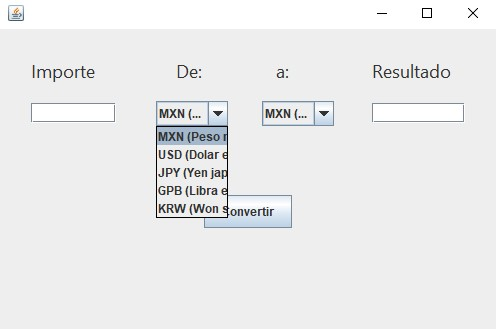
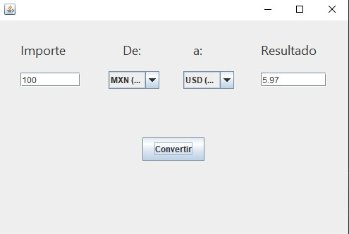

# Conversor de Monedas
Este proyecto es un conversor de monedas desarrollado como parte del programa OracleOne. Permite convertir cantidades de una moneda a otra utilizando tipos de cambio predefinidos.

## Características
* Interfaz gráfica intuitiva para ingresar el importe, seleccionar la moneda inicial y la moneda final.
* Conversión precisa utilizando tipos de cambio predefinidos.
* Admite conversiones entre diferentes monedas, como Peso Mexicano (MXN), Dólar Estadounidense (USD), Yen Japonés (JPY), Libra Esterlina (GBP) y Won Surcoreano (KRW).
* Resultado mostrado en tiempo real.

## Requisitos del sistema
* Java Development Kit (JDK) 8 o superior.
* Entorno de desarrollo Java (IDE) como IntelliJ IDEA o Eclipse.

## Instalación
1. Clone el repositorio del proyecto o descargue el código fuente en formato ZIP.
2. Importe el proyecto en su entorno de desarrollo Java.
3. Compile y ejecute el archivo CurrencyConverterApp.java ubicado en el paquete com.mycompany.conversordemonedas.

## Cómo utilizar
* Ejecute la aplicación.
* Ingrese el importe que desea convertir en el campo "Importe".
* Seleccione la moneda inicial en el menú desplegable "De:".
* Seleccione la moneda final en el menú desplegable "a:".
* Haga clic en el botón "Convertir".
* El resultado de la conversión se mostrará en el campo "Resultado".

